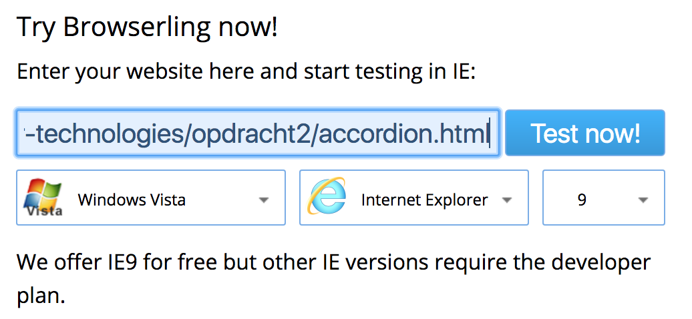
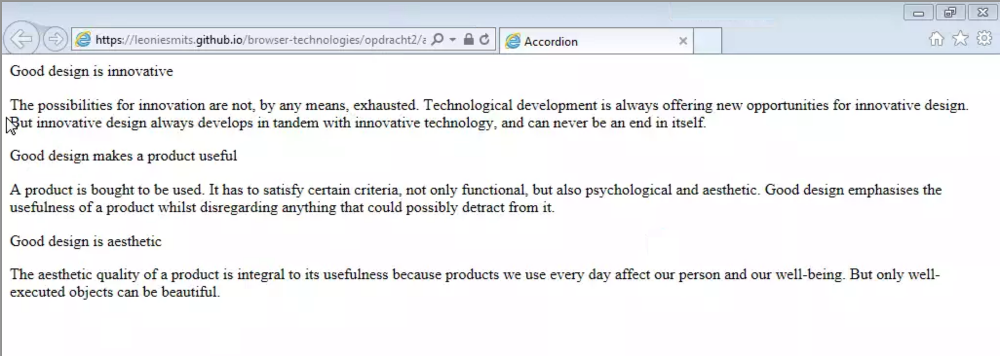
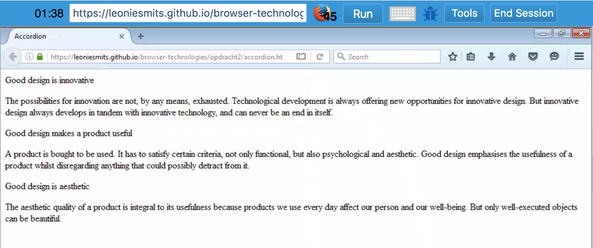

# Browser Technologies - Week 3
> Robuuste, toegankelijke websites maken

## Concept

For the assignment, I chose the enquete. The enquete had to work without JavaScript and the user can go back to the previous question to review and/or change their answer. 

The concept I made of this, is more of a quiz. The user gets a few questions on their skin and gets presented with a personalized skin care routine. Not with products they should buy, but with the active substances in these products to educate them on what works en why.

## The assignment

The assignment is divided in three categories: 


## Progressive enhancement
> In this subject we focus on a strategy of building websites around their core functionality. Then more detailed and elaborate layers are added. This makes for a functional layer that always works, in every circumstance. Then, a more reliable, usablue and even pleasurable layer is added on top of that.

The message this subject tells us is: The web is for everyone (as Tim Berners Lee once said). 

### What did I do?
For progressive enhancement, I went back to the oldest from of making a form: plain HTML and server-side handling. I defined the core functionality as:
 
 __The user can fill in one form per page, submit the answers, and get a results page based on their answers.__

 To do this, I dived in what forms can really do. 

In the HTML: 
 ```HTML
 <form name="routine" method="post" action="/quiz/2" id="form1">
    <input type="submit" value="submit">
 </form>
 ```
In the Node.js server: 
```javascript
app.post('/quiz/2', function (req, res) {

    res.render('quiz/2', state)
})
```

This way, the submit button actually submits the page and directs to the next one. 

Now, to give the answers to the next page, I first started using cookies. With a bodyparser I subtracted the answers, then put them in cookies, sent them as parameter to the next page, and got them from there as cookies aswell. 

Could be shorter.

Inside the second HTML page:
```HTML
 <form name="skin_type" method="post" action="/quiz/3" id="form2">

            <input type="hidden" name="routine" value="<%- routine %>">
            
            <label><input type="radio" id="1" name="skin_type" value="oily" required>Oily</label>

            <input type="submit" value="submit">
</form>
```

Inside the node.js server: 
```javascript
app.post('/quiz/3', function (req, res) {
    const state = {
        routine: req.body.routine,
        skin_type: req.body.skin_type
    }
    res.render('quiz/3', state)
})
```
Instead of a cookieparser, I used a bodyparser to get the value of the answer, put them in an object, and sent them to the next page. Then, I put the values of the previous page in an input field with type="hidden". This way, the value is given to the next page and ready for the bodyparser to read again. This makes for a waterfall of values, but it's only 4 pages with questions, so eh?

## Feature detection
> Feature detection is a strategy where you check the support of elements, functions and features of the web. First, we have to check if there is any support, secondly, we have to write a fallback. The fallback doens't have to be as good as the original feature, but has to give the user a replacing one.

First, I wanted client side javascript to replace the submit button and use ```.submit()``` on the radio buttons, so the user didn't have to press a button. BUT: This may be confusing for the user. A submit button adds the value that the user actually _feel_ like the answers they chose are sent somewhere. Which they are.

In CSS I have some feature detection, `@supports` for `display: flex;` and for `(counter-reset: unset);`. This way, they just fall back on unstyled elements, which are fine!

In Javascript, it was hard to come up with something to enhance the features to give the user a more complete experience. The results page would be pretty long, so I decided that the answers should be in a drop-down. For this, I chose to use `<detail>` and `<summary>` tags.

#### The support:
> Global usage % of all users = 89,65% 

browser | support | support since
-----|-------|--------------
Internet Explorer | no | - 
Edge | no | -
Firefox | yes | 2016
Chrome | yes | 2011
Safari | yes | 2012
Safari/Chrome iOS| yes | 2013
Opera Mini | no | -
Chrome for Android | yes | 2018
UC for Android| yes | 2016
Samsung Internet | yes | 2016

As Ischa Gast said: 
> When you feel 99% is enough support, you litarally limit the people you care about.

89,65% isn't that much support. This was a good case to put feature detection to work.

#### What I did: 

```HTML
<details>
    <summary><h2><%- data.cleanser.oil.name %></h2></summary>
    <span>Description:</span><p class="description"><%- data.cleanser.oil.description %></p>
    <span>The effects:</span><p class="effects"><%- data.cleanser.oil.effects %></p>
    <span>Directions:</span><p class="directions"><%- data.cleanser.oil.directions %></p>
</details>       
```
In this EJS template, the heading is the clickable part of the drop down, all information that follows is hidden. 

Client side javascript:
```javascript
if (!('open' in document.createElement('details'))) {
    if (document.querySelectorAll && document.createElement('_').classList) {
      var headingTitle = document.querySelectorAll('summary')
      for (var i = 0; i < headingTitle.length; i++) {
        headingTitle[i].parentNode.childNodes[3].classList.add('hide')
        headingTitle[i].addEventListener('click', function (elem) {
          var headingContent = this.getAttribute('heading-content')
          this.parentNode.childNodes[3].classList.toggle('hide')
          this.parentNode.childNodes[3].classList.toggle('show')
        })
      }
    }
  }
```
CSS:
```CSS
.show {
    display: block;
}
.hide {
    display: none;
}
```

Older browsers display a list with every detail element under each other, which isn't that much of a problem because all users can still see the content. I used Javascript to still make it interactive for users. According to my core functionality pyramid, making the content more readable is part of the page being "usable". 

_On a side note; this element DOES work in .md files._
<details><summary>Look</summary>How crazy is that</details>

First I ofcourse tested this in my own browser, Chrome 65. I was surprised that this feature works with just HTML, no Javascript or styling needed. Then I started testing browsers that don't support these HTML elements.
I used [browserling](https://www.browserling.com/internet-explorer-testing) to test for IE9 (which was free, other versions were paid). I pushed this element on github and opened it in browserling.
Testing the accordion on Internet Explorer 9

On Firefox 45 (2016)

On Opera Mini


## Accesibility
> Accesibility gets overlooked by a lot of designers and developers, though it's easy to test. [Ischa Gast](https://ischagast.nl/) gave us an awesome presentation at Schiphol and showed us what happens when people with disabilities try to use the web.

IT's not finished
