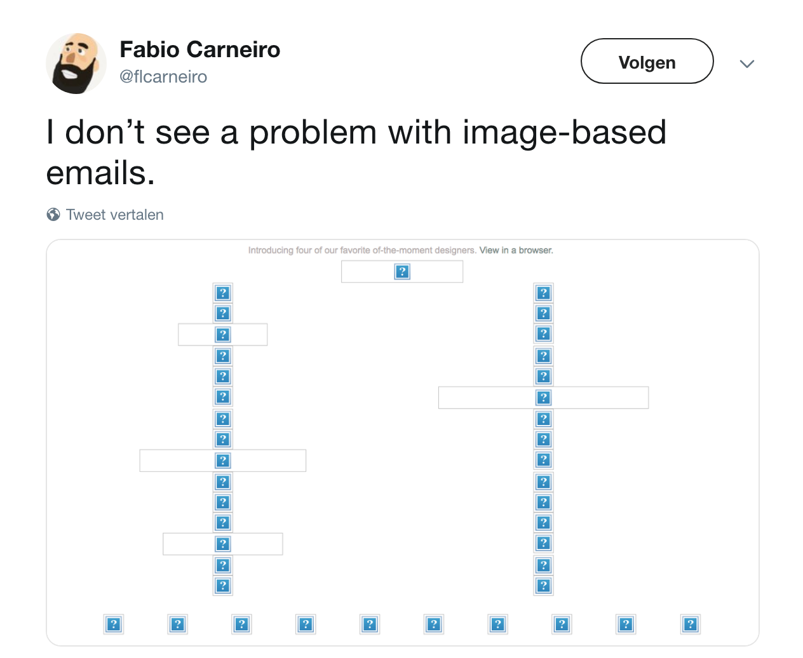
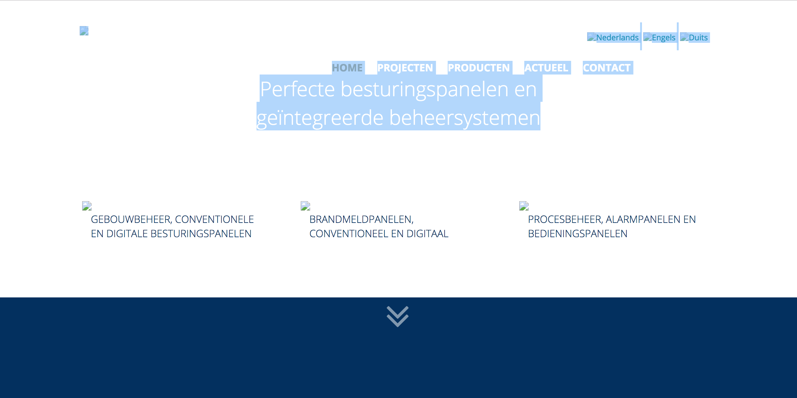
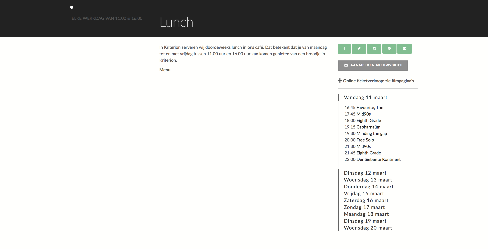

# Browser Technologies
## Opdracht 1.1 - Breek het web
Het Web laten 'breken' door features van het platform bewust uit te zetten. Images, custom fonts, JavaScript, kleur, breedband internet.

## Afbeeldingen
Afbeeldingen kunnen ontbreken wanneer:
- De padnaam niet klopt
- De naam verkeerd is gespeld
- De site die de afbeeldingen host offline is/niet werkt
- Transfer probleem wanneer de afbeelding extern staat
- Afbeeldingen worden geblokt omdat ze onveilig zijn

_Wanneer afbeeldingen niet laden, kan er een probleem ontstaan met de layout, leesbaarheid, navigatie, ectcetera. Nog erger is zoals hierboven: de gebruiker krijgt helemaal niets aan content te zien._

Door dit te testen bij de website [peuman.nl](https://pneuman.nl), is te zien dat er niet goed is nagedacht over hoe de pagina eruit ziet wanneer afbeeldingen niet laden.

_De homepage zoals hij hoort te zijn:_

_De homepage waarbij de afbeeldingen uit staan:_

_De content geselecteerd, zodat de tekst leesbaar is:_

De tekst is wegens de kleur niet meer leesbaar en de navigatie staat niet meer in de menubalk. De pagina is nu eigenlijk niet meer bruikbaar. 

Nog een voorbeeld is de [lunchpagina van Kriterion](https://www.kriterion.nl/filmevenement/lunch)

De belangrijkste informatie op deze pagina staat in een afbeelding. Wanneer deze niet laadt, kan de gebruiker het menu en de prijzen daarvan niet zien. 

Door ALT-tags te gebruiken, wordt een deel van dit probleem wel makkelijk opgelost. Dit is natuurlijk voor screen-readers erg handing, maar ook om een gebruiker wat meer context te geven wanneer de pagina niet laadt. 

Test wel altijd of deze ALT-tag wel goed op de pagina komt te staan. Bij Moodle is een voorbeeld te zien van hoe dit mis kan gaan:

