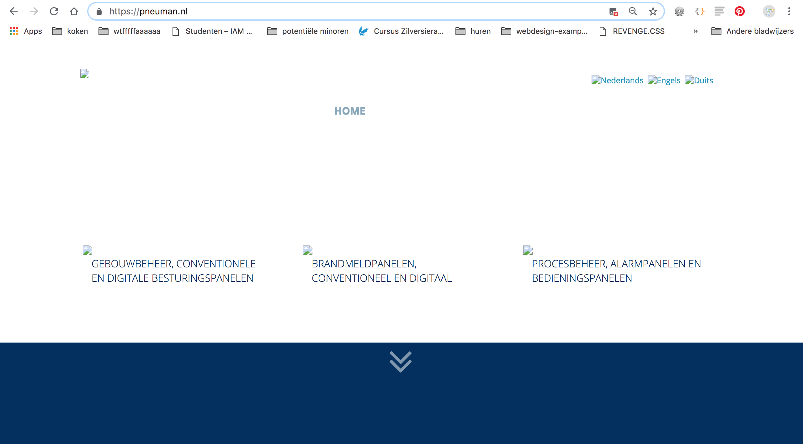
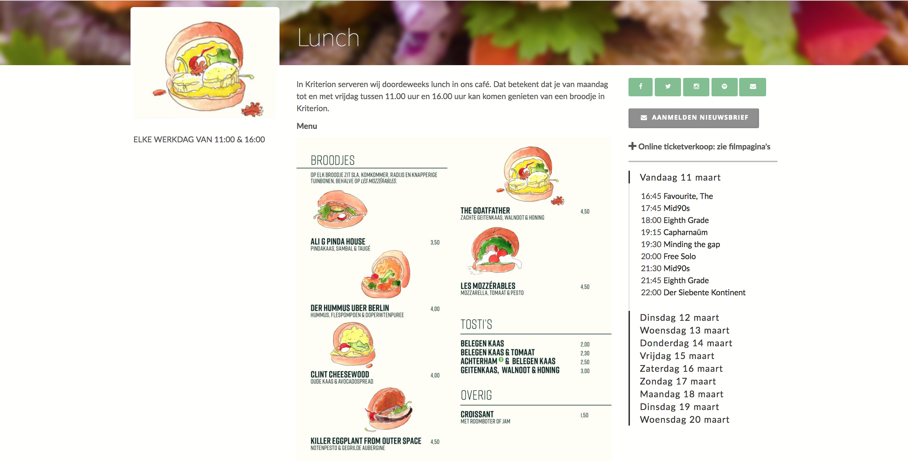
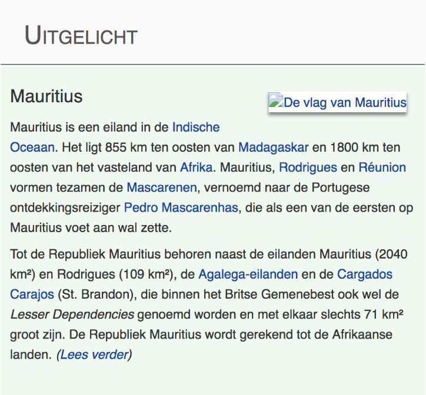
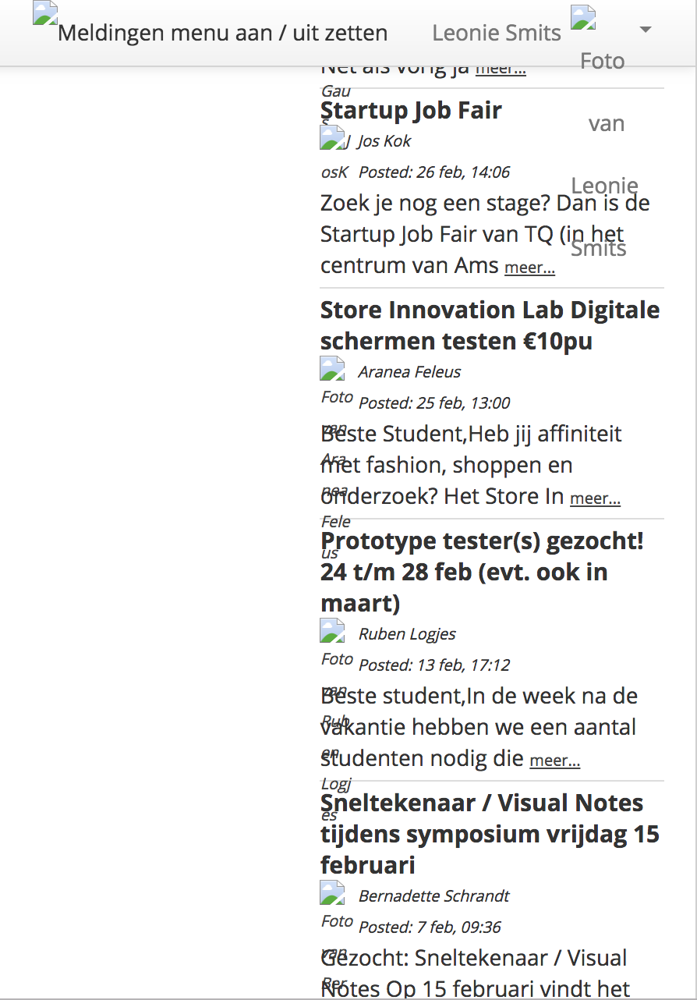
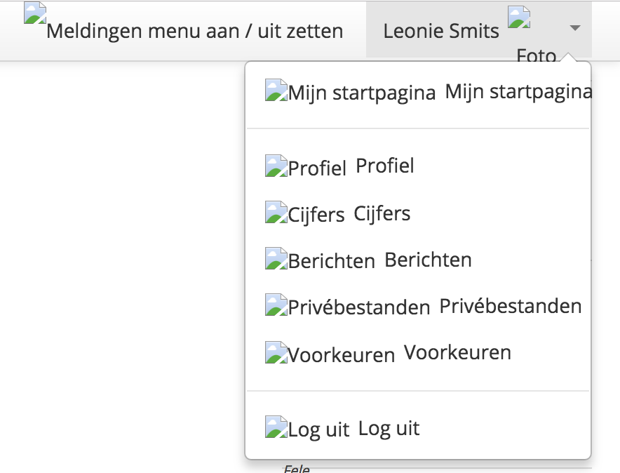
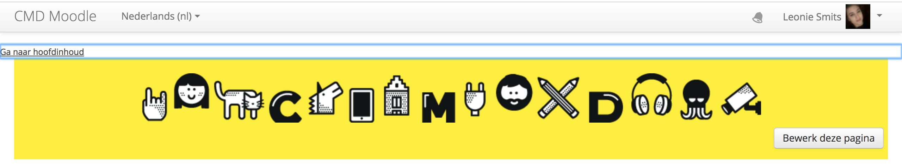
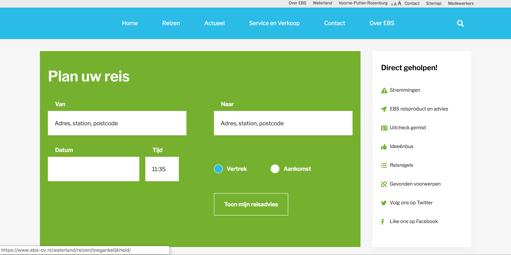
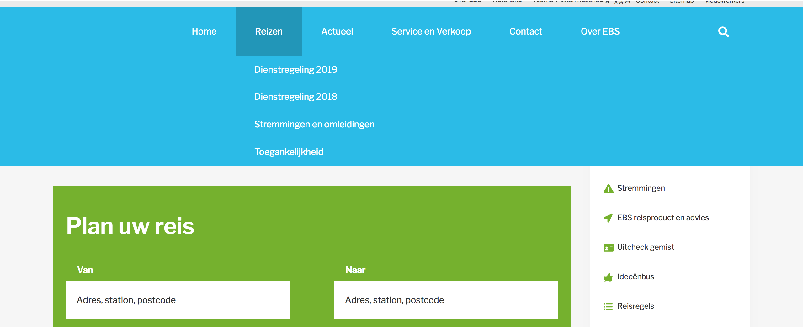
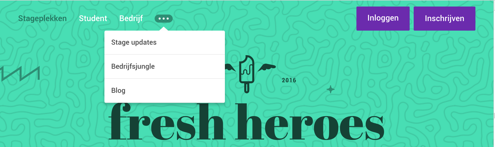
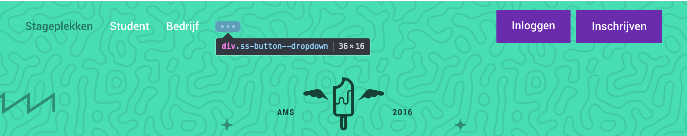

# Browser Technologies
## Opdracht 1.1 - Breek het web
Het Web laten 'breken' door features van het platform bewust uit te zetten. Images, custom fonts, JavaScript, kleur, breedband internet.

## Afbeeldingen
Afbeeldingen kunnen ontbreken wanneer:
- De padnaam niet klopt
- De naam verkeerd is gespeld
- De site die de afbeeldingen host offline is/niet werkt
- Transfer probleem wanneer de afbeelding extern staat
- Afbeeldingen worden geblokt omdat ze onveilig zijn


_Wanneer afbeeldingen niet laden, kan er een probleem ontstaan met de layout, leesbaarheid, navigatie, ectcetera. Nog erger is zoals hierboven: de gebruiker krijgt helemaal niets aan content te zien._

Door dit te testen bij de website [peuman.nl](https://pneuman.nl), is te zien dat er niet goed is nagedacht over hoe de pagina eruit ziet wanneer afbeeldingen niet laden.

_De homepage zoals hij hoort te zijn:_

_De homepage waarbij de afbeeldingen uit staan:_

_De content geselecteerd, zodat de tekst leesbaar is:_


De tekst is wegens de kleur niet meer leesbaar en de navigatie staat niet meer in de menubalk. De pagina is nu eigenlijk niet meer bruikbaar. 

Nog een voorbeeld is de [lunchpagina van Kriterion](https://www.kriterion.nl/filmevenement/lunch)




De belangrijkste informatie op deze pagina staat in een afbeelding. Wanneer deze niet laadt, kan de gebruiker het menu en de prijzen daarvan niet zien. 

Door ALT-tags te gebruiken, wordt een deel van dit probleem wel makkelijk opgelost. Dit is natuurlijk voor screen-readers erg handing, maar ook om een gebruiker wat meer context te geven wanneer de pagina niet laadt. 



Test wel altijd of deze ALT-tag wel goed op de pagina komt te staan. Bij Moodle is een voorbeeld te zien van hoe dit mis kan gaan:




Wat Moodle wel goed doet, is het gebruik van een `skip content` link. 
Wel jammer dat het daarna nog bijna 30 tabs is naar het hoofdmenu, maar dat terzijde.

### TLDR:
Test hoe je pagina eruit ziet wanneer de afbeeldingen uit staan. Geef je afbeeldingen een alt-tag voor screen-readers en als fallback.
- Controleer de layout zonder de afbeeldingen
- Controleer de leesbaarheid en het kleurencontrast wanneer afbeeldingen ontbreken
- Zet belangrijke informatie niet in afbeeldingen of maak hiervoor een fallback

## Muis/trackpad
Een muis of trackpad wordt vaak over het hoofd gezien bij dingen die mis kunnen gaan. Natuurlijk geldt dit voor gebruikers die een muis of trackpad niet __kunnen__ gebruiken door bijvoorbeeld een beperking. Daarbij kan de muis, trackpad of touchscreen kapot gaan. Er komen ook situaties voor waarin gebruiker maar 1 hand vrij heeft. 

De enige mogelijkheid die de gebruiker dan heeft, is om `tab` en `enter` te gebruiken om te navigeren. Hoewel steeds meer websites rekening houden met deze manier van gebruik, gaat het ook erg vaak mis. 

Het eerste probleem is dat de `:focus` state wordt weggehaald door een styling keuze. Schrijf nooit `outline: none;` zonder ook een alternatief voor de `:focus` state toe te voegen. 


Hier is te zien hoe de gebruiker wel kan tabben, maar niet te zien krijg waar hij zich bevindt. 

Het menu klapt uit, maar doet dit alleen op `:hover`. Er is meer mis met dit menu. Het menu klapt uit door een class die via javascript wordt toegevoegd. Daarnaast ziet de opbouw er zo uit:
```html
<ul>
    <li class="main-menu-item has-sub-menu">
        <a></a>
        <div class="sub-menu-container">
            <div class="container">
                <div class="row">
                    <div class="col-12">
                        <ul class="sub-menu">
                            <li class="sub-menu-item">
                                <a></a>
                            </li>
                        </ul>
                    </div>
                </div>
            </div>
        </div>
    </li>
</ul>    
```
## 😖

Een oplossing voor zo'n probleem kan zijn door een button te plaatsen in de eerste `<ul>` en bij het klikken de tweede `<ul>` te tonen. Veel functionaliteiten worden al opgelost door HTML juist te gebruiken.

In dit voorbeeld van [Fresh Heroes](https://freshheroes.com/) kan de gebruiker het menu met 3 puntjes niet openen met `tab`. 


Dit komt omdat het een `div` is die alleen met `:hover` wordt aangesproken. De `div` heeft als class "button". Het probleem wordt opgelost door deze `div` ook echt te veranderen naar een `button` zodat het element doet wat hij moet doen.

Het gebruik van `tab` en `enter` is ook geen goede manier om de toegankelijkheid van screen-readers te testen. Voor de meeste problemen zit ook hier de oplossing in goed gebruik van HTML. 

### TLDR:
Het testen van je website door enkel `tab` te gebruiken geeft je ontzettend belangrijke inzichten. Je zorgt dat je website: 
- toegankelijk is voor mensen die hun trackpad/muis niet normaal gebruiken
- dat screen-readers je website zonder problemen kunnen gebruiken
- een goede hierarchie heeft die later geen problemen oplevert
- goed gebruik maakt van HTML (waarvoor het is bedoelt💖)


