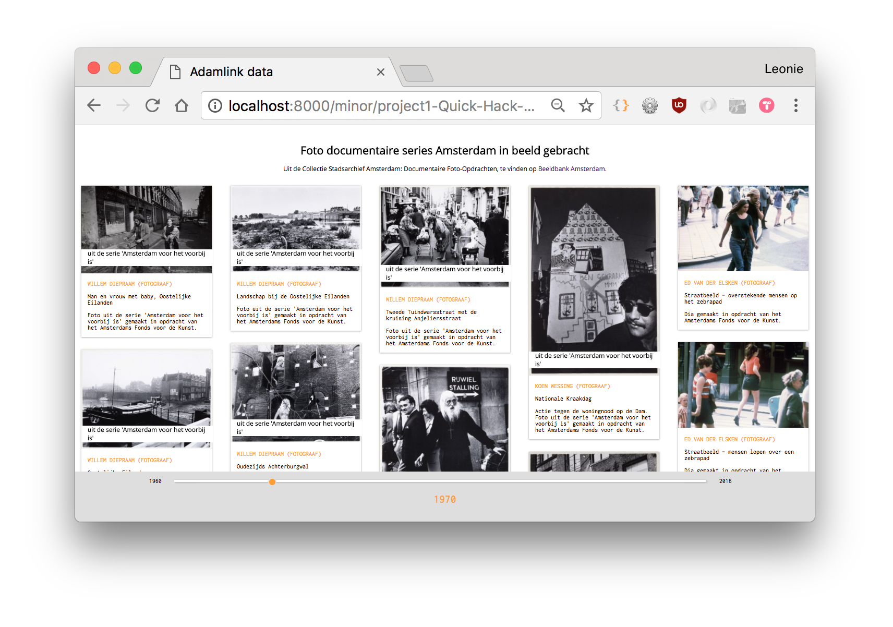
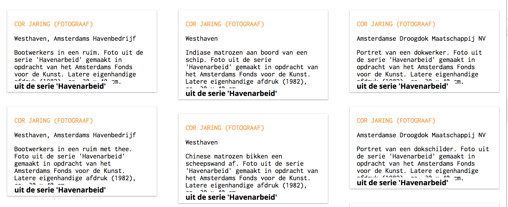
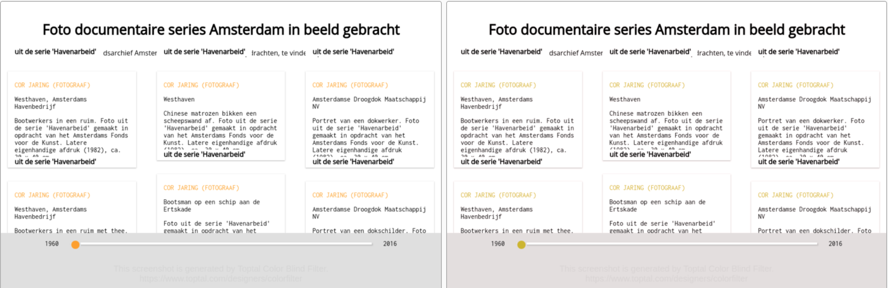
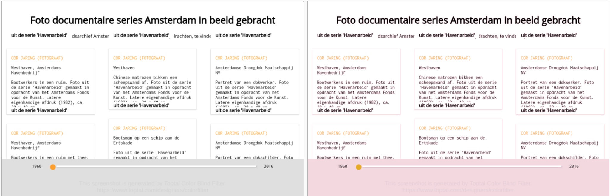
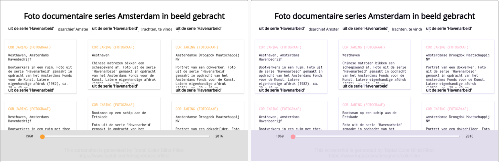
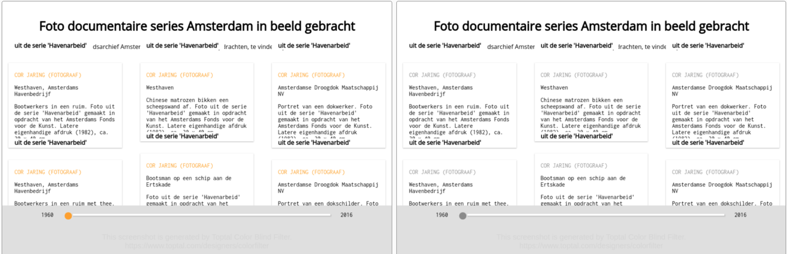
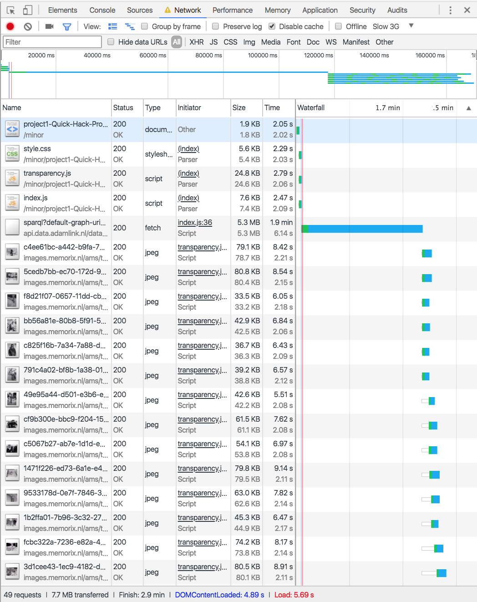
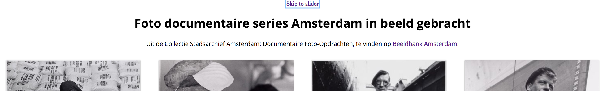

# API Stadsarchief Amsterdam

This is the project I made for the OBA project week last year. 
[link to the project](https://leoniesmits.github.io/browser-technologies/opdracht1/)


> __A problem__: Something changed in the  OBA API since I used it last year, and I can't figure out what. Only images within "De Weteringbuurt" are loaded. So where I first got 6000+ resutls, I only get 52 now..

## 8 Progressive enhancement features 

### 1. Images
The page consists almost entirely of images. These are loaded in by Javascript request and are put in HTML with Transparency.js. Without these images, there isn't much to see. 

There are a few problems with the images as they are now:
##### the grid
All images are by different photographers, so the width and height of portrait or landscape are never the same. I wanted to use [masonry.js](https://masonry.desandro.com/), but was unable to set a height and width. I faked the masonry look with column-width in CSS. The problem this causes, is that the elements are loaded vertically. Images that would load at the bottom and wouldn't be visible, are now loading in the left lane for a long time. The lagging of the grid can be reduces by giving the images a height and width before loading them in.

##### Alt-tags
A big problem with my images, is that I didn't give them Alt-tags. These are important for screen readers and to give some content when images don't load. This can be done with the variable directives.

```javascript
        (..) items.forEach(function(obj, i) {
                    objects.push({
                        image: obj.img.value,
                        description: obj.description.value,
                        title: obj.title.value,
                        source: obj.cho.value,
                        serie: serieValue[i],
                        creator: obj.creator.value,
                    })
                })

var directive = {
                image: {
                    src: function(){
                        return this.image
                    },
                    alt: function() {
                        return this.title
                    }
                }
            }
```

##### Name of the series
There is another bug, the name of the series. I gave them a negative margin to position it, but without images it falls over other elements. 

### 2. Font
All fonts I use are custom fonts, I haven't even tried to set a pretty fallback font. As we did in Performance matters, I could load the fonts asynchronized. This way, the standard font is shown first and the custom font takes over when it's done loading. The <noscript> is used to set a fallback that doesn't need javascript.
```css
<link rel="preload" href="/path/css/file.css" as="style" onload="this.rel='stylesheet'">
<noscript><link rel="stylesheet" href="/path/css/file.css"></noscript>
```
Instead of just defining the font in every CSS element, I could set up a new file with @font-face to use stacks of fonts and set fallbacks easier. 

### 3. Color
On the site [toptal](https://www.toptal.com/designers/colorfilter) I tested for all color blindness. 
I think the results are pretty good, since I stuck with one color and one grey. The contrast is alright, although the font makes the yellowish orange I used a little harder to read. I could experiment with making it darker.
These are the results: 

> Left: original, right: colorblind version
#### Protanopia

#### Deutranopia

### Tritanopia

### Greyscale


### 4. Breedband Internet
> I tested in Chrome on Slow 3G network

Didn't really go well. Fetching the API takes a long time and without the API I have no content. 
In total the loading took __2.9 minutes(!)__.

A solution would be to request just a few images with the API call. Only problem is that I request 6.000 images, and only 44 should be shown in the first screen. The slider starts at 1960, so these are shown first. Maybe loading in these 44 before even requesting the API could work for the page. On the other hand, after all these images are loaded, the user doesn't have to wait really long for the rest of the images.

This problem is the biggest one so far, and finding a solution will take me some more time.

### 5. Trackpad
Luckily, I noted this while working on the project, so the page has a "skip to slider" -button. This directs the user to the slider, which can be used with the arrow keys. This is only accessable with the tab-key, so doesn't disturb users who use the mouse. 

##### Slider
There is a problem with getting from the slider to the images, as it starts at the bottom and isn't visible directly. I've played with the HTML of the slider, maybe putting it at the top in the DOM. This way, focussing on the slider seems smoother. Maybe the tab-index of the slider needs to be set, as the user needs to go back to this element at any time. 
##### Grid
Back to the grid, as this causes multiple problems. The grid is set up vertically, which causes the focus to go up and down on tab. This can be confusing and frustrating to the user. The pictures that are next to each other in the screen, are actually pretty far away from each other in accessibility. 


### 6. Javascript
Since my Javascript fetches the API and injects this to the HTML, without it there is nothing to show. Only the loader and slider are visible. An infinite loader and slider that goes nowhere. Very sad.

Unfortunately, there isn't much to do about this problem. As mentioned before, maybe loading in the first 44 photo's will narrow down the frustration users without javascript will feel. 

### 7. Local storage
> Doesn't apply

### 8. Cookies
> Doesn't apply

##### To do: 
- images
    - Figure out the grid for the images (like this [pretty grid](https://codepen.io/bcwang/pen/OxRMeb?editors=0110)). The grid needs to be horizontally made up.
    - Right now, all images are .jpg files. I need to figure out if I can compress them.
    - A fixed width/height for the images could help the structure when the images are loading or when just one doesn't work
    - Test with screen reader
- font
    - Load async
- color
    - Play with a little darker detail color
- breedband
    - Loading the first few images could prevent the user from seeing nothing for a really long time
- trackpad 
    - Play with the positioning of the slider
    - Way more :focus and :focus-within styling, it's pretty unclear now
- breedband
    - With slow or unstable internet, this page is very frustrating. There has to be something on the screen while loading.

## Device Lab
